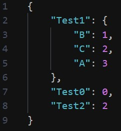
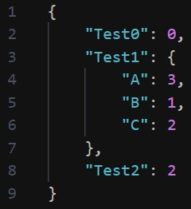

# JSON Sorter

Sorts a JSON file (lexicographically) in-place (including any nested objects).

### Usage:

Single JSON file:

```
$ ./sort-json.py path/to/file.json
```

Multiple JSON files:

```
$ ./sort-json.py file1.json file2.json file3.json
```

[Sample JSON file](sample.json) before and after sorting:

| Before                                       | After                                      |
| -------------------------------------------- | ------------------------------------------ |
|  |  |
